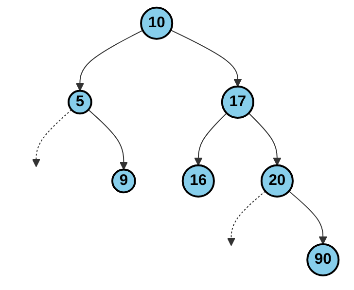

# Práctica: Árbol Binario AVL

Este repositorio contiene la implementación y resolución de las operaciones sobre un árbol AVL.

## Estructura Final del Árbol

## Recorridos Obtenidos
* **Preorden:** `[10, 5, 9, 17, 16, 20, 90]`
* **Enorden:** `[5, 9, 10, 16, 17, 20, 90]`
* **Postorden:** `[9, 5, 16, 90, 20, 17, 10]`
